# Clmakase — OliveYoung Flash-Sale Defense System

> **CloudWave 7th Cohort · Final Project**
> A 150,000-VU concurrent flash-sale event system on AWS EKS, verified end-to-end via a 20-minute Datadog-measured load test.
> Domain: `clmakase.click` · Region: `ap-northeast-2`

🇰🇷 한국어 버전: [README.md](README.md)

Signature: a backend engineer who does not close a problem at feature-implementation level, but redesigns it from the angles of operability, integrity, and scalability. Measurement always happens one layer below.

---

## ✨ At a Glance

- **Production-grade modern stack on AWS EKS** — Kafka 3-Broker StatefulSet, Karpenter (Spot + OnDemand allowed; 26 Spot nodes selected at the 150K-VU peak), KEDA composite scaling, ArgoCD GitOps, Istio service mesh (mTLS PERMISSIVE), Terraform 16-module IaC, GitLab CI/CD 8-step pipeline (7 GitLab stages + ArgoCD auto-sync).
- **150,000 VU load test passed** with 0 OOMKilled · 0 5xx errors · P99 ≤ 180 ms · 4.65 M total requests in 20 min; all 26 peak nodes selected as Spot.
- **Backend-driven trouble-shootings (11 documented)** reproducible against the codebase — most notably the **Aurora "Too many connections" formula derivation** (`maxReplicas × pool_size ≤ max_connections`) that turned scale-out itself into a DB attack surface.
- **Monthly operational cost**: **$786.45** (AWS Pricing Calculator).

---

## 🛒 Why This Project Exists (Background)

Modelled on **the Olive Young flash-sale event** — when 150,000+ customers attempt to buy the same limited-quantity products in the same minute, and every architectural failure mode (DB connection exhaustion, broker outages, cold-start latency, scale-out paradoxes) surfaces simultaneously. The Olive Young event was chosen because:

- It is a **public, recurring, time-bounded** workload — the load curve is reproducible in a test environment with k6.
- It is a **high-stakes correctness scenario** — over-selling a single SKU costs trust; under-serving costs revenue; both must be prevented even during partial infrastructure failure.
- It exercises the full stack — CDN, edge, ALB, EKS, Kafka, Aurora, Redis — under a single coordinated load profile.

Goal: defend a 150,000-VU spike with zero 5xx errors, zero OOM events, and broker-failure recovery under 500 ms — verified by a 20-minute Datadog-measured load test on 2026-02-26.

---

## 🎯 Verified Metrics (Datadog, 2026-02-26)

Measured by Datadog `as_rate()` query over a 20-minute window — full evidence in [evidence/load-test-2026-02-26/](evidence/load-test-2026-02-26/).

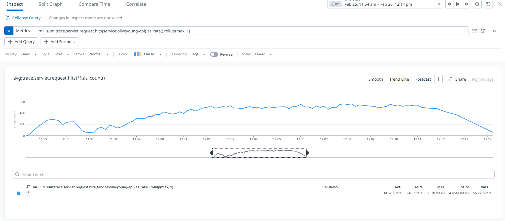

| Metric | Value | Source |
|---|---|---|
| **Peak RPS** | **56,300 hits/s** | [Datadog screenshot](evidence/load-test-2026-02-26/datadog-rps-overview.png) |
| **Stable RPS** | **49,500 hits/s** (peak-window average) | same |
| **Total requests** | **4.65 M hits** (20 min) | same (Datadog SUM) |
| **Success rate** | **100 %** (zero 5xx errors) | same |
| **P99 latency** | **≤ 180 ms** | Datadog APM |
| **OOMKilled** | **0** | k8s event log |
| **Service interruption** | **none** | Datadog uptime |
| **Max API pods** | **100** (KEDA `maxReplicas`) | k8s metrics |
| **Max nodes** | **26** Spot instances (~128 vCPU / ~600 GB) | Karpenter event log |
| **Broker-failure P95** | **3,137 ms → 436 ms (87 % improvement)** | Version A vs Version C ([CSVs](.)) |
| **Order-data loss under broker failure** | **0** (Non-blocking Retry + DLT) | Version C invariant |

> **Datadog query**: `sum:trace.servlet.request.hits{service:oliveyoung-api}.as_rate().rollup(max, 1)`
> **Test window**: 2026-02-26 11:54 am – 12:14 pm KST

---

## 💰 Cost (FinOps)

Closing a system into an operable state means also looking at *real cost*. As a 6-person capstone we used AWS Pricing Calculator to estimate monthly spend and designed Karpenter Spot + consolidation to reclaim cost during off-peak.

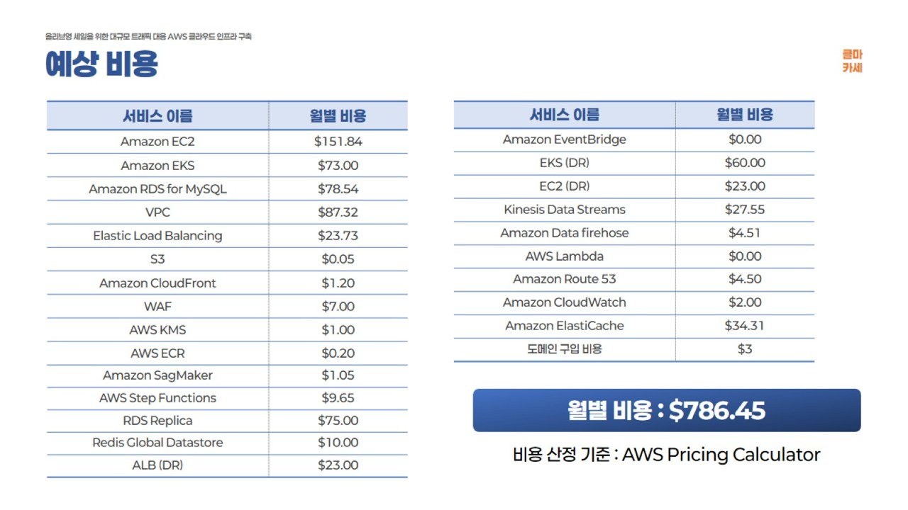

| Area | Monthly | Notes |
|---|---|---|
| EC2 (Karpenter Spot heavy) | $151.84 | 26 peak nodes, auto-reclaim off-peak |
| EKS Control Plane | $73.00 | |
| RDS Aurora MySQL | $78.54 | t3.medium (dev environment) |
| VPC + NAT + Endpoint | $87.32 | |
| ElastiCache Redis | $34.31 | |
| Kinesis Data Streams + Firehose | $32.06 | VPC Flow Logs forensics |
| Others (S3, ALB, WAF, KMS, ECR, SageMaker, Step Functions, RDS Replica, Redis Global Datastore, ALB DR, EKS DR, EC2 DR, Route53, CloudWatch, EventBridge, Lambda, domain) | $329.38 | |
| **Total** | **$786.45 / month** | AWS Pricing Calculator |

<details>
<summary>📊 Real-usage monitoring capture (expand)</summary>

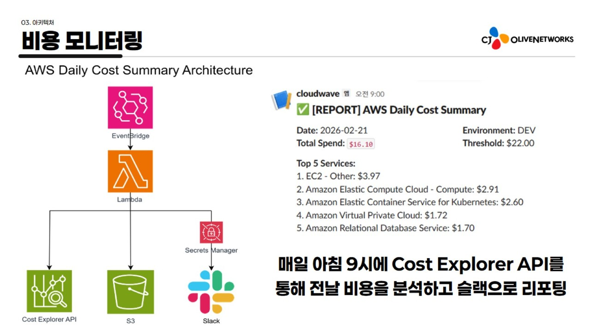

During the test-operation period we tracked actual usage in AWS Cost Explorer. Temporary instances such as `cache.r7g.large` were documented to be downgraded back to `cache.t3.micro` immediately after each load test, captured as an operational rule in LOAD_TEST_PLAN.md.

</details>

---

## 👤 Role & Responsibilities

6-person capstone. I owned the **CI/CD + Container & Compute** track. Security / AI / DR / Network / Monitoring tracks were teammate-owned; I integrated them only at the Terraform-module-composition layer.

### Owned — directly responsible (CI/CD + Container & Compute)

- **Backend (Spring Boot)** — order-processing service, Kafka producer/consumer, `@RetryableTopic` + `@DltHandler`, **7 custom Micrometer counters** for stage-level retry observability.
- **The Aurora connection-pool formula** — derived `maxReplicas × pool_size ≤ Aurora_max_connections`, reduced HikariCP `pool_size` from 10 → 5 as the first step.
- **Kafka 3-Broker StatefulSet** — RF=3, `min.insync.replicas=2`, 20 partitions, Idempotent Producer, Non-blocking Retry topic with 3-stage backoff (1 s → 5 s → 30 s) and DLT.
- **Terraform 16-module IaC architecture** — VPC, EKS, RDS, ElastiCache, ALB controller, ArgoCD, ECR, S3, CloudFront, ACM, Route53, security-groups, secrets, waf, kms, cli (SSM Bastion).
- **Karpenter migration** — full transition from Managed Node Group; resolved a chain of 16 cascading errors during stabilization.
- **KEDA composite scaling** — Kafka consumer-lag trigger + Datadog RPS trigger + Cron warm-up trigger; tuned `maxReplicas=100` and `scaleUp 50 pods / 30 s`.
- **GitLab CI/CD 8-step pipeline** — `test → build → trivy-scan → update-manifest → deploy-secrets → deploy-frontend → load-test → ArgoCD trigger`. commit-SHA-based image tag rewriting via `sed`, `[skip ci]` infinite-loop prevention, CloudFront cache auto-invalidation.
- **DevSecOps in CI** — Trivy CVE scanning integration, ECR auto-scan configuration, Renovate dependency-update automation.
- **K8s manifests** — `Deployment` (with `spec.replicas` field intentionally removed for KEDA single-source-of-truth), KEDA `ScaledObject`, Karpenter `NodePool` / `EC2NodeClass`, Istio sidecar resource tuning (256 Mi → 10 Gi).
- **150,000-VU final load test** — designed scenario, executed via k6 distributed (`parallelism=10`, 15,000 VU per pod, 8 core / 16 GB), wrote the engineering reflection on expected vs measured RPS divergence.

### Team-led — Terraform module composition only, policy content teammate-owned

- **Security** (Im Wanryeol, Lee Minyoung): WAF rules, KMS key policies, Secrets Manager rotation, Cloud Custodian forensics, Istio mTLS PeerAuthentication.
- **AI** (Lee Minyoung): VPC Flow Logs based anomalous IP detection.
- **DR** (Lee Minyoung): Route53 health-check based failover to ap-northeast-1 secondary.
- **Network** (Oh Jeonggyun, Kim Mingyeong): VPC / Subnet / SG design.
- **Monitoring** (Kim Sunhoo, Kim Mingyeong): Datadog Dashboard, CloudWatch + Falco + Loki/Tempo/Grafana stack.

---

## 🤝 Process & Team Collaboration

The 3-week capstone used the following tools and processes.

- **Schedule**: Notion Gantt chart with reverse-planning from deadlines (project start 2/3, mid-review 2/19, final 2/27).
- **Documentation & meeting notes**: Notion DB-based weekly meetings and pre-presentation reviews; meeting-note writing order standardised (5-step `##` headings).
- **User stories & Kanban**: Miro 3-frame user-story mapping → task-card decomposition → Kanban board.

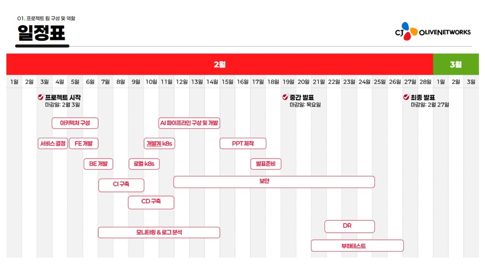

### Two decision-making examples (within owned scope)

- **Aurora invariant turned into a team checklist**: the formula `maxReplicas × pool_size ≤ Aurora_max_connections` discovered during load testing was folded into the *"pre-validate before every scale-policy change"* operational process. Every scaling PR thereafter included a formula-check item.
- **Cascade troubleshooting → Kafka Lag trigger replaced by Datadog RPS trigger**: after diagnosing a consumer-group registration race condition, the team decided to *cut the dependency on internal metrics and unify on externally-visible metrics* (details in [troubleshooting #11](#11-issue-1--cascade-error-and-keda-trigger-paralysis)).

---

## 🏛️ System Architecture

### Full Architecture


The AWS account is split into 6 planes:

1. **Edge security** — Route53 → WAF → CloudFront → S3
2. **EKS production VPC** (Multi-AZ) — Ingress ALB → EKS pods → Aurora / ElastiCache
3. **Developer-access VPC** (separated) — Session Manager + Client VPN + CLI Server → ECR / EKS
4. **Observability plane** — CloudWatch, Datadog, Falco, Istio, Prometheus, Loki, Tempo, Grafana
5. **Security-automation plane** — IAM, KMS, ASM, GuardDuty, Inspector, Access Analyzer, Config, Security Hub, ACM, WAF, Shield
6. **DR + forensics plane** — ap-northeast-2 primary ↔ ap-northeast-1 secondary (Aurora Replica + ElastiCache Global DB) + VPC Flow Logs → Kinesis → S3 → EventBridge → Step Functions → SageMaker → Lambda → Slack

### Production Plane (user-facing traffic)


User traffic flow:

1. User → Route53 → CloudFront (with S3 static frontend offload)
2. WAF → Internet Gateway → Ingress ALB
3. EKS pods (Multi-AZ across two AZs)
4. NAT in each public subnet for egress
5. ElastiCache + Aurora in private data subnets
6. Bastion Server for admin access

The orange box across the AZs marks the Kafka 3-Broker StatefulSet boundary.

### Development Plane (internal access)


Internal access:

- **Admin** — Session Manager → ECR
- **Developer** — Client VPN → CLI Server (private subnet) → EKS / RDS / ElastiCache
- **GitLab** — pushes images to ECR through a VPC Endpoint; egress through public-subnet NAT

<details>
<summary>🎬 Demo videos + ASCII text diagram (expand)</summary>

| Title | Link |
|---|---|
| 🎬 **Load Test Demo** — k6 distributed load test driving the system to 150,000 VU | [youtube.com/watch?v=WcVVNoNMsG8](https://www.youtube.com/watch?v=WcVVNoNMsG8) |
| 🎬 **Frontend Demo** — User-facing flash-sale flow walkthrough | [youtube.com/watch?v=sHEY-YEHfT4](https://www.youtube.com/watch?v=sHEY-YEHfT4) |

```
User
 │ HTTPS
 ▼
CloudFront ──────────── S3 (React static hosting)
 │
 ▼
WAF ─── ALB (api.clmakase.click)
            │
            ▼
        EKS Cluster (ap-northeast-2)
          │
          ├─ oliveyoung-api Pod × 1~100
          │   ├─ KEDA ScaledObject (Kafka lag / Datadog RPS / Cron)
          │   └─ Istio sidecar (mTLS PERMISSIVE)
          ├─ Kafka 3-Broker StatefulSet + Zookeeper
          ├─ Karpenter NodePool (c/m/r 6th-gen+, Spot+OnDemand mix)
          └─ ArgoCD (GitOps · selfHeal · prune)
              ├─ Aurora MySQL (Multi-AZ, HikariCP pool=5)
              └─ ElastiCache Redis (queue state)
```

</details>

---

## 🔧 Tech Stack

| Layer | Technology |
|---|---|
| **Orchestration** | EKS v1.30 + Karpenter v1.0.1 |
| **Messaging** | Kafka 3-Broker StatefulSet + Zookeeper (RF=3, `min.insync=2`, 20 partitions) |
| **Auto-scaling** | KEDA composite trigger (Kafka lag / Datadog RPS / Cron warm-up) |
| **GitOps** | ArgoCD + GitLab CI/CD (8-step pipeline) |
| **Service mesh** | Istio mTLS (PERMISSIVE stage; STRICT planned after sidecar-less services Kafka/Zookeeper verification) + Kiali |
| **Data** | Aurora MySQL (Multi-AZ, t3.medium) + ElastiCache Redis |
| **IaC** | Terraform 16 modules + S3 backend + DynamoDB state lock |
| **Monitoring** | Datadog APM + Prometheus (Kiali-only, 6 h retention) |
| **Security (CI)** | Trivy CVE scan + ECR auto-scan + Renovate (Owned) |
| **Security (Network/Data)** | WAF + KMS + Secrets Manager + Cloud Custodian (Team-led) |
| **CDN** | CloudFront + S3 + ACM + Route53 |
| **Backend** | Spring Boot · Java 17 · Micrometer (7 custom counters) |

---

## 🚦 Backend Deep Dives

### 1. The Scale-Out Paradox — Aurora "Too many connections"

During load testing, scaling out pods caused Aurora to fail rather than the bottleneck it was meant to relieve. The defect lived at the application's connection-pool level.

**Diagnosis.** Each Spring Boot pod opens up to `pool_size` connections. With KEDA scaling pods to `maxReplicas=100` and a default `pool_size=10`, the cluster requested up to 1,000 simultaneous DB connections — far past Aurora's `max_connections` budget.

**Formula derivation.**
```
total_db_connections = maxReplicas × HikariCP.pool_size
must hold:  total_db_connections ≤ Aurora.max_connections
```

**Resolution — multi-step, not a single commit:**

1. Reduced HikariCP `pool_size` from 10 → 5.
2. Honest recheck: with Aurora `t3.medium`'s default `max_connections ≈ 90`, `100 × 5 = 500` still exceeds the budget — the pool reduction alone does not satisfy the invariant.
3. Tuned KEDA `minReplicas` + added a Cron warm-up trigger so the *effective* Pod count during peak windows stays well below the worst-case 100.
4. Filed "upgrade Aurora instance class" as the next-cycle operational backlog item so the invariant can be re-satisfied at the infra layer.
5. Standardised the formula as a pre-flight check before every scale-policy change.

This is the headline story for **why I am a backend engineer who happens to operate infrastructure, not the other way around**: the symptom appeared in EKS metrics, but the root cause was in the Spring Boot connection pool, and the honest fix needed both layers.

### 2. Kafka Non-blocking Retry + DLT

A single broker failure in the early architecture (Version A) produced **3,137 ms P95 latency** and lost order data. The cause was a single-broker SPOF compounded by a Circuit Breaker → Redis fallback path that itself was high-latency.

**Kafka's role — Traffic Shield**: Kafka absorbs bursty write traffic in a buffer zone, shielding Redis and Aurora from direct load.

**Redesign (Version C).** 3-Broker StatefulSet (RF=3, `min.insync.replicas=2`) with `@RetryableTopic` and a non-blocking retry pipeline:

```
order-events (origin)
  │ failure
  ├─ order-events-retry-0  (1 s   delay)   ← network jitter
  │   │ failure
  ├─ order-events-retry-1  (5 s   delay)   ← DB back-pressure
  │   │ failure
  ├─ order-events-retry-2  (30 s  delay)   ← serious infra failure
  │   │ failure
  └─ order-events.DLT                       ← manual replay
```

**Result (broker-1-down chaos test, 100 users):**

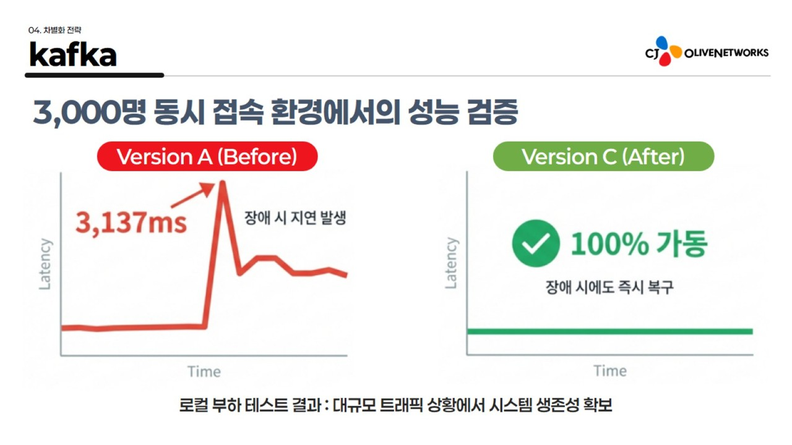

| Metric | Version A | **Version C** |
|---|---|---|
| Throughput | 0.4 req/s | **3.3 req/s** |
| P95 latency | 3,137 ms | **436 ms (–87 %)** |
| Order data | **lost** | **preserved** |

7 Micrometer custom counters (`order_success_total`, `order_retry_total{stage=0|1|2}`, `order_dlt_total`, `kafka_retry_total`, `dlt_messages_total`) make the failure layer identifiable from the dashboard alone — a stage-2 spike means infra failure, a stage-0 spike means transient network jitter, etc.

<details>
<summary>📐 Kafka Traffic Shield + Non-blocking Retry visual diagrams (expand)</summary>

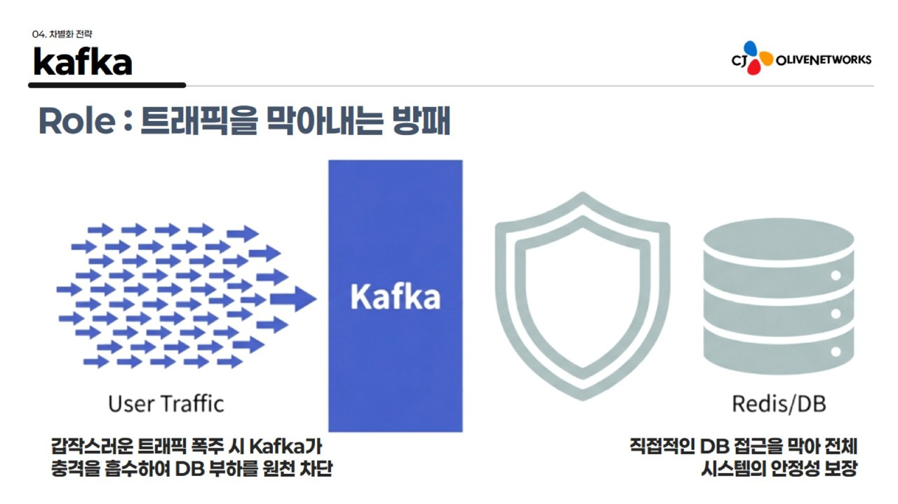

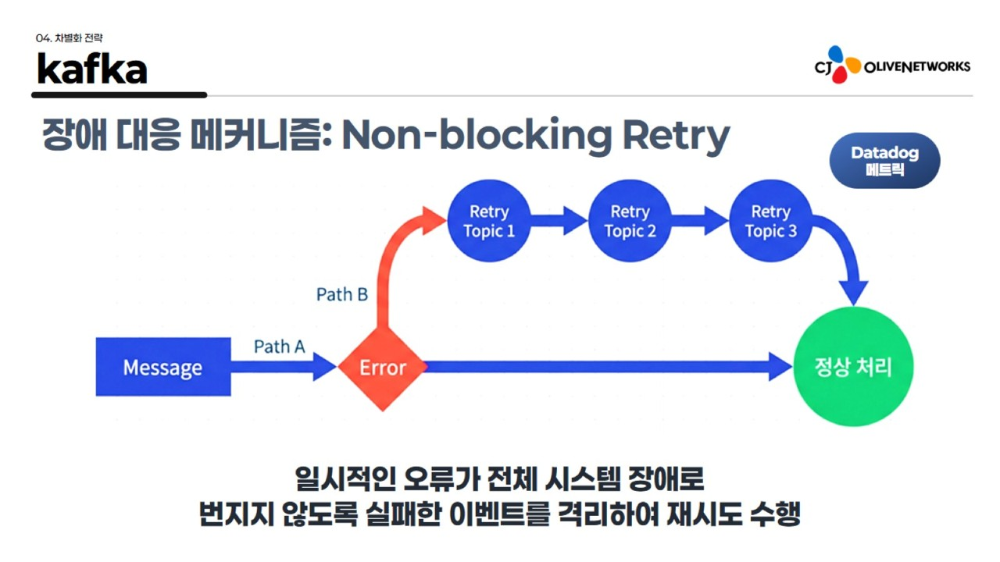

</details>

### 3. Cold Start Defense — KEDA Warm-up + Karpenter

Sale-open traffic was arriving 2 minutes faster than EKS could provision new nodes, producing a cold-start dip in the first 30 seconds.

**Resolution.**
- **Cron-triggered warm-up.** KEDA `cron` trigger raises `minReplicaCount` to 10 starting 23:50 KST (the night before each sale).
- **Aggressive scaleUp.** `50 pods / 30 s` policy (vs default 10 / 30 s).
- **Karpenter consolidation.** Single NodePool allows both Spot and OnDemand (Spot was selected for all 26 peak nodes), `consolidationPolicy: WhenUnderutilized` for cost recovery during off-peak.

In the final load test, scale-out completed within 60 seconds of the load arriving — verified in the Datadog evidence files.

### 4. DevSecOps in CI

Three security tools integrated into the CI pipeline.

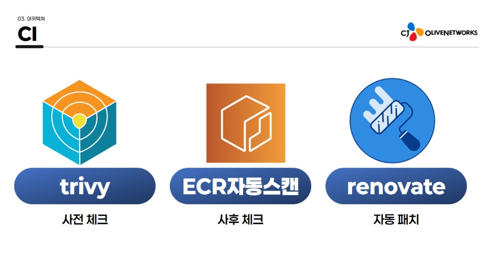

| Tool | Stage | Role |
|---|---|---|
| **Trivy** | Pre-check | CVE scan in the build stage; build fails on high/critical findings. Real Tomcat 10.1.45 / CVE-2025-55754 patch history through this gate. |
| **ECR auto-scan** | Post-check | Every image push triggers AWS ECR vulnerability scan; results visible in the AWS console. Continuous monitoring after deployment. |
| **Renovate** | Auto-patch | Automated dependency-update PRs minimising known-vulnerability exposure time. Grouped patches with a weekly schedule for non-urgent items. |

<details>
<summary>📐 Full 8-step CI/CD pipeline flow (expand)</summary>

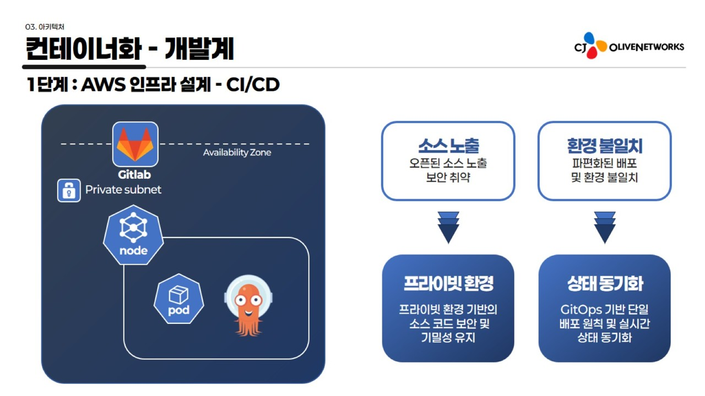

</details>

---

## 📡 Observability & Monitoring (summary)

My direct responsibility is limited to **Datadog APM integration** (KEDA triggers + Micrometer metric exposure). The full monitoring stack (CloudWatch + Falco + Prometheus + Loki + Tempo + Grafana) is owned by the monitoring track (Kim Sunhoo, Kim Mingyeong); I integrated it via Terraform module composition and backend metric exposure (`/actuator/prometheus`).

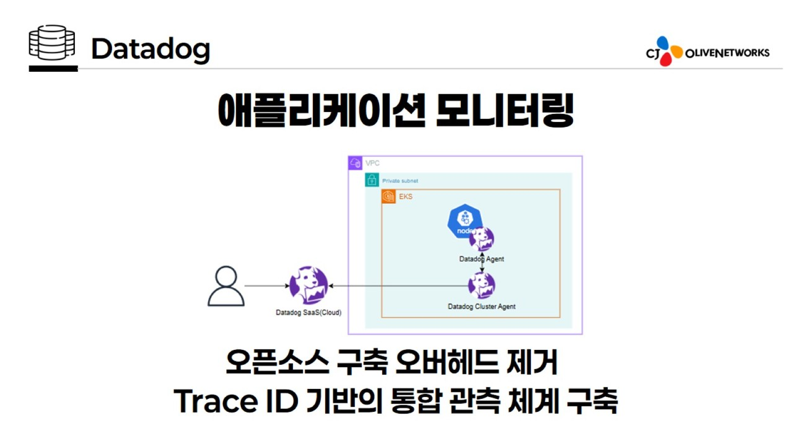

- **Owned**: Datadog Agent DaemonSet + Cluster Agent + `/actuator/prometheus` openmetrics integration + Trace-ID-based unified observability.
- **KEDA trigger metric**: `sum:trace.servlet.request.hits{service:oliveyoung-api}.rollup(sum, 60)` single query for RPS-based scaling (see troubleshooting #11).

<details>
<summary>📊 Monitoring assets (expand) — Kubernetes Dashboard / CloudWatch / Automation tools</summary>

**Datadog Kubernetes Health & Errors Dashboard** (teammate Kim Sunhoo · Kim Mingyeong owned):

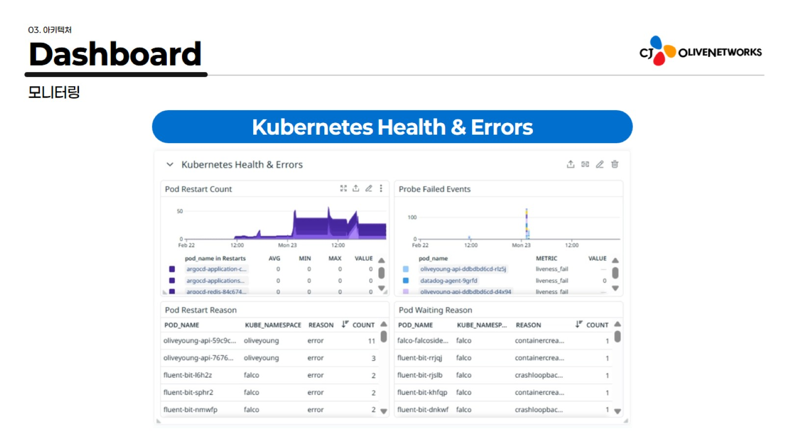

**Container monitoring — CloudWatch auxiliary pipeline** (CloudWatch → SNS → Lambda → Slack):

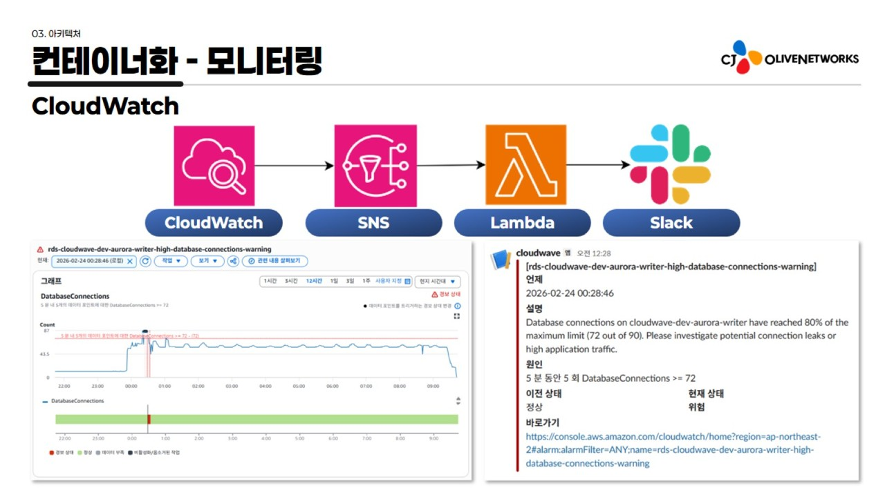

**Automation tools** (Terraform + Cloud Custodian):

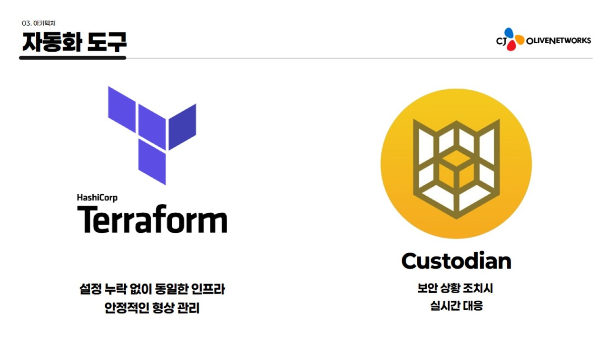

</details>

---

## 🛡️ Team-led Areas

Tracks outside my direct responsibility are summarised here as *result image + 2-line description*. I integrated them as Terraform-module-composition only; policy and implementation details are teammate-owned.

<details>
<summary>🔒 Security (Im Wanryeol · Lee Minyoung owned) — Cloud Custodian Critical isolation</summary>

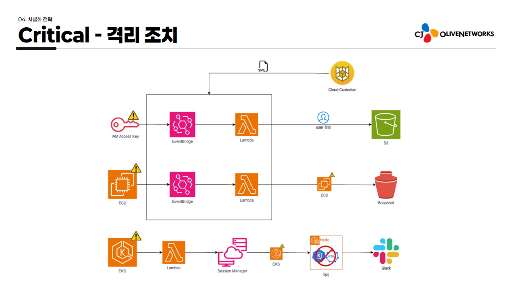

IAM Access Key exposure / abnormal EC2 / abnormal EKS events trigger EventBridge → Lambda, calling Cloud Custodian policies for immediate isolation, snapshot preservation and Slack alerting. My contribution was Terraform module composition only; YAML policies are teammate-owned.

</details>

<details>
<summary>🔒 Security — Istio mTLS (Im Wanryeol owned) — namespace-level encryption + Zero Trust</summary>

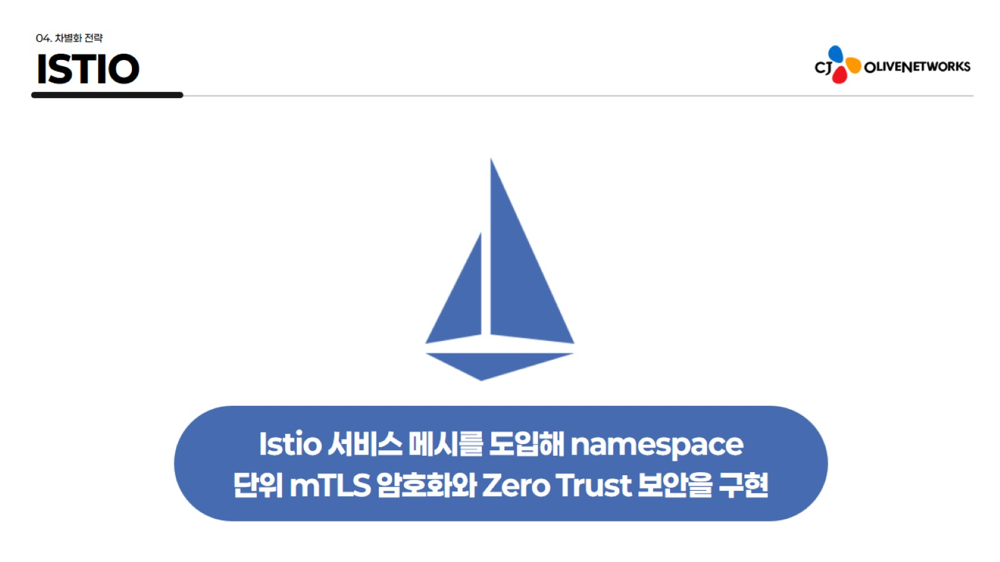

Service-mesh-level namespace mTLS encryption + Zero Trust security. Currently operating in PeerAuthentication PERMISSIVE stage; STRICT migration planned after sidecar-less services (Kafka, Zookeeper) verification. My contribution: Istio sidecar resource tuning (256 Mi → 10 Gi).

</details>

<details>
<summary>🧠 AI (Lee Minyoung owned) — VPC Flow Logs based anomalous IP detection</summary>

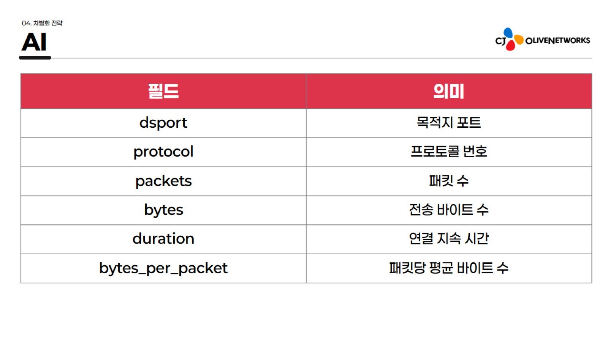

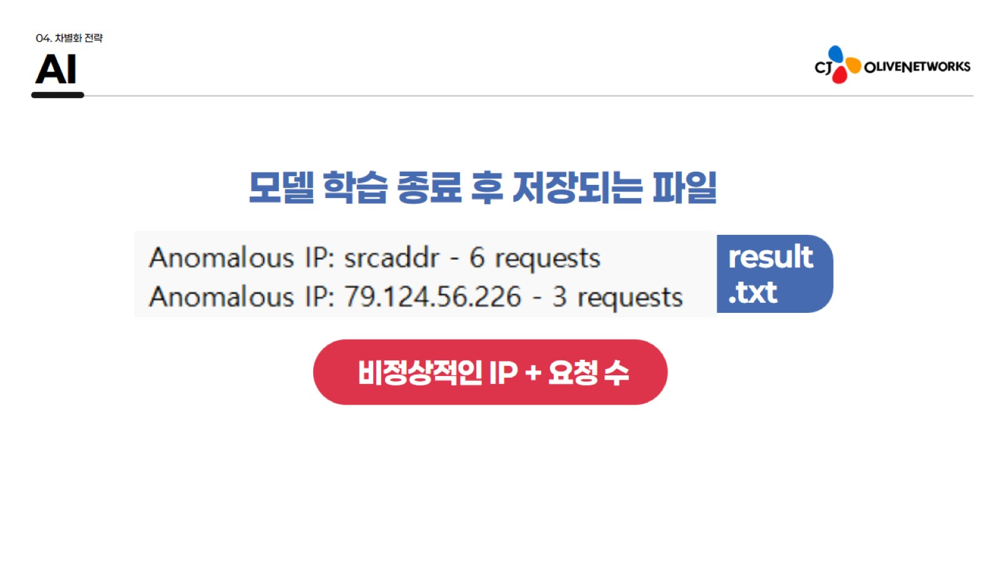

VPC Flow Logs (dsport, protocol, packets, bytes, duration, bytes_per_packet) trained via Kinesis → S3 → SageMaker; abnormal IP + request count output to `result.txt`. My contribution: Terraform module composition only.

</details>

<details>
<summary>🌐 DR (Lee Minyoung owned) — Route53 Health Check based ap-northeast-1 secondary failover</summary>

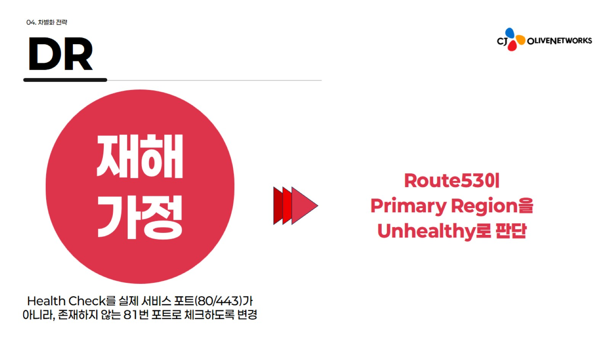

Route53 auto-fails over to secondary when Primary Region is judged Unhealthy. Health Check was changed from real service ports (80/443) to the non-existent port 81 to validate a disaster scenario. My contribution: Terraform module composition only.

</details>

---

## 🛠️ Trouble-shootings (11 verified)

| # | Problem | Root cause | Resolution | Layer |
|---|---|---|---|---|
| 1 | Kafka broker failure → P95 3,137 ms | Single-broker SPOF + CB → Redis fallback latency | 3-Broker + Non-blocking Retry + DLT | Messaging |
| 2 | KEDA not scaling | `Deployment.spec.replicas` overrode HPA | Removed the `replicas` field entirely | K8s |
| 3 | Sale-open cold start | `minReplicas=2` insufficient | Cron trigger + `minReplicas=10` warm-up | KEDA |
| 4 | EKS node provisioning failed 3× | Managed Node Group structural conflict | Migrated to Karpenter; resolved 16 cascading errors | Infra |
| 5 | Aurora "Too many connections" | `maxReplicas × pool_size > max_connections` | Derived formula; pool 10 → 5 + minReplicas tuning + instance-upgrade backlog | **Backend ↔ DB** |
| 6 | ArgoCD selfHeal overwrote Secret | Secret defined inside git YAML | Removed Secret YAML; CI-only injection | GitOps |
| 7 | ArgoCD didn't deploy new image | `latest` tag → manifest unchanged → no diff | Commit-SHA tag + `update-manifest` job | CI/CD |
| 8 | Mixed Content blocking | CloudFront cached old JS + hard-coded `http://` | Relative paths + CI cache invalidation | Frontend ops |
| 9 | Terraform circular dependency | RDS ↔ Secrets cycle | Removed `db_host` from Secrets module | IaC |
| 10 | istio-proxy OOMKilled at 150 K VU | Memory limit 256 Mi insufficient | Limit raised to 10 Gi; request/limit separated | Service mesh |
| 11 | **Cascade error paralysing KEDA trigger** | Kafka consumer-group registration race condition | Replaced Kafka Lag trigger with Datadog RPS single trigger | KEDA |

Each item has corresponding commit history in this repository.

### #11 ISSUE #1 — Cascade error and KEDA trigger paralysis

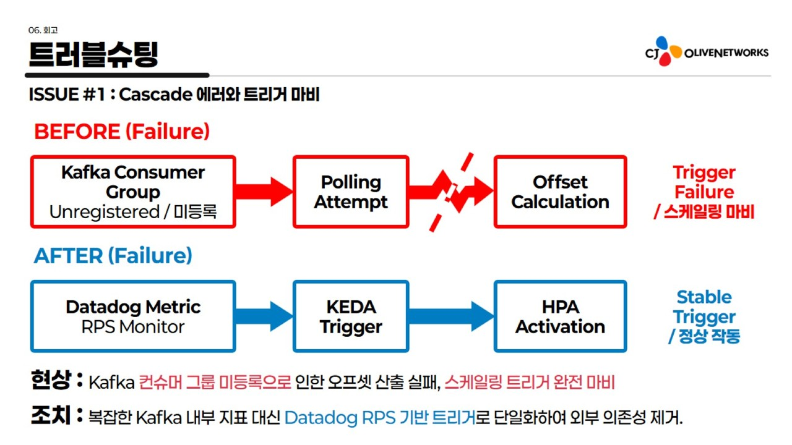

**Symptom**: During the load event, KEDA failed to scale pods up. A race condition occurred where the Kafka consumer group hadn't fully registered before KEDA started lag polling → offset calculation failure → scaling trigger completely paralysed.

**Action**:
- Replaced the complex Kafka internal metric (consumer-lag) with a **Datadog RPS-based single trigger**, removing the external dependency.
- New trigger flow: `Datadog Metric (RPS Monitor) → KEDA Trigger → HPA Activation` (stable, working normally).
- Operational judgment: *cut internal-metric dependency, unify on externally-visible metrics.*

**Rationale**: prioritised infrastructure availability above all else. Replaced offset-sensitive Kafka triggers with Datadog, which reliably collects real-time RPS. Adds an external-SaaS dependency, but the operational stability gain was the larger value.

---

## 📊 Engineering Reflection — Expected vs Measured RPS

**Expected (theoretical) at 150 K VU:** ~112 K RPS.
**Measured at peak:** 56.3 K RPS.

The gap was not an error — it was two compounding effects:

1. **Iteration period stretch.** Under load, server response time grew, which extended the k6 VU iteration period from ~10 s to 20 s+. Each VU's effective RPS contribution halved during the steady state.
2. **Sidecar overhead.** Every request traverses an Istio sidecar; the proxy's per-hop cost throttled aggregate throughput.

**Conclusion.** 56.3 K RPS was achieved with **zero error budget consumed**, on **all-Spot instances**, with **60-second responsiveness** to the load arrival via KEDA + Karpenter. The correct number to cite is the measured 56.3 K, not the theoretical 112 K.

---

## 📁 Project Structure

```
Clmakase/
├── backend/
│   └── src/main/java/com/oliveyoung/sale/
│       ├── config/                          # Redis, Kafka, init data
│       ├── controller/                      # REST controllers
│       ├── domain/                          # Entities (Product, PurchaseOrder)
│       ├── dto/
│       ├── repository/
│       └── service/
│           ├── KafkaProducerService.java
│           ├── KafkaClusterConsumerService.java
│           └── OrderConsumerService.java    # Order processing + Non-blocking Retry
├── frontend/                                # React app
├── k8s/
│   ├── deployment.yaml                      # No replicas field — KEDA-only control
│   ├── keda/
│   ├── node-class.yaml                      # Karpenter EC2NodeClass
│   ├── node-pool.yaml                       # Karpenter NodePool (Spot+OnDemand)
│   ├── istio/
│   └── monitoring/
├── terraform/
│   ├── main.tf
│   ├── karpenter_iam.tf
│   └── modules/                             # 16 modules
├── custodian/                               # (team-led)
├── k6/
│   └── load-test.js
├── assets/                                  # README visual assets
│   ├── architecture/                        # full / production / development plane + dev-cicd-rationale
│   ├── cost/                                # monthly-estimate / usage-monitoring
│   ├── process/                             # schedule
│   ├── monitoring/                          # datadog-architecture / cloudwatch-pipeline / k8s-dashboard
│   ├── kafka/                               # role-traffic-shield / non-blocking-retry / local-load-test
│   ├── ci/                                  # trivy-ecr-renovate / pipeline-flow
│   ├── troubleshooting/                     # cascade-trigger
│   ├── security/                            # critical-isolation / istio-mtls (team-led)
│   ├── ai/                                  # network-flow-fields / anomaly-detection (team-led)
│   └── dr/                                  # route53-health-check (team-led)
├── evidence/
│   └── load-test-2026-02-26/                # Datadog screenshot + reports
├── docker-compose-version-a.yml             # Single-broker baseline
├── docker-compose-version-c.yml             # 3-broker + Retry
└── .gitlab-ci.yml                           # 8-step pipeline
```

---

## 🌐 API Reference (selected)

### Products
- `GET /api/products`
- `GET /api/products/{id}`

### Sale lifecycle
- `GET  /api/sale/status`
- `POST /api/sale/start`
- `POST /api/sale/end`

### Queue
- `POST /api/queue/enter`
- `GET  /api/queue/status`

### Purchase
- `POST /api/purchase`

Common response shape:
```json
{
  "success": true,
  "data": { },
  "message": "...",
  "errorCode": null
}
```

---

## 🚀 Local Development

### Version A (single broker + Circuit Breaker)
```bash
docker-compose -f docker-compose-version-a.yml up -d
# Frontend:  http://localhost:3000
# Backend:   http://localhost:8081
```

### Version C (3-broker + Non-blocking Retry)
```bash
docker-compose -f docker-compose-version-a.yml down
docker-compose -f docker-compose-version-c.yml up -d
# Backend: http://localhost:8082
```

### A/B comparison load test (local)
```powershell
# Windows PowerShell
.\load-test-compare.ps1
```

---

## ❓ Engineering Decisions Q&A

### Q. Why Kafka instead of SQS?
1. **Partition-keyed ordering.** `productId`-based partitioning preserves per-product order and parallelizes across products.
2. **Full retry control.** SQS DLQ is one-shot; `@RetryableTopic` lets us stratify retries by failure cause at the code level.
3. **Replay.** DLT preserves failed messages for analyzed re-processing — non-negotiable for revenue data.

*Trade-off accepted*: more operational surface area (StatefulSet management, broker IDs, RF tuning).

### Q. Why EKS instead of ECS?
1. **GitOps ecosystem.** ArgoCD + KEDA + Karpenter + Istio compose natively on K8s.
2. **Auto instance selection.** Karpenter automatically chooses instance families that match workload requirements (ECS Capacity Providers are more limited).
3. **Unified operational metrics.** Datadog APM auto-recognises K8s metadata, producing richer tracing context than ECS.

*Trade-off accepted*: Control Plane cost + K8s operational learning curve.

### Q. Why Karpenter instead of Managed Node Group?
The *trigger* was Managed Node Group hitting `NodeCreationFailure` three times in a row. But the rationale for switching was active: (1) automatic instance-family selection across the c/m/r 6th-gen+ pool per workload, (2) Spot + OnDemand mixed economics, (3) `consolidationPolicy: WhenUnderutilized` for automatic off-peak recovery.

### Q. Why Datadog instead of self-hosted Prometheus + Grafana?
1. **APM auto-tracing.** K8s metadata + Spring Boot auto-instrumentation + Trace-ID-unified observability with zero config.
2. **Lower operational burden.** No Prometheus HA + alertmanager operations team (6-person capstone).
3. **Cost-conscious.** `DD_TRACE_SAMPLE_RATE: 0.05` (5 % sampling) tunes spend; resources reclaimed during idle.

*Trade-off accepted*: external SaaS dependency, data lock-in. The Kiali-only Prometheus is kept separate with only 6-hour retention.

### Q. Why Redis Sorted Set for the queue?
- `score = timestamp` → FIFO ordering
- `ZRANK` → O(log N) rank lookup
- `ZADD` / `ZREM` → atomic operations under concurrency
- Centralized state across multiple EKS pods

### Q. How did you set Readiness/Liveness probes?
```yaml
readinessProbe:
  initialDelaySeconds: 90    # Spring boot ~80 s + buffer
  failureThreshold: 5
livenessProbe:
  initialDelaySeconds: 150
  failureThreshold: 5
```
`initialDelaySeconds` must be at least the actual app boot time + ~10 s. Aggressive probes terminate healthy pods that are still starting.

### Q. How is Terraform state managed?
S3 backend + DynamoDB lock table for remote state. Environment is currently dev only (stg / prod split is a follow-up item).

---

## 📚 Lessons Learned

1. With KEDA, **always remove `Deployment.spec.replicas`**.
2. **Never define Secrets in git YAML** — ArgoCD selfHeal will fight you.
3. **Use commit SHA as the image tag** — `latest` makes ArgoCD blind to changes.
4. **Pre-calculate** `maxReplicas × pool_size` against Aurora `max_connections` before every scale change.
5. Probe `initialDelaySeconds` = real boot time + 10 s minimum.
6. Scale-out is **reactive**; sale-open requires **proactive warm-up**.
7. **Build success ≠ deploy success** — verify the manifest-update step closes the loop between CI and CD.
8. Bind operational metrics to **externally-visible indicators** (RPS); keep internal-state metrics (Kafka lag) as auxiliary. Trigger unification is operational stability.

---

## 🚧 Technical Debt (Designed; implementation in progress)

Items the project intentionally closed at "operable" rather than "complete" — left as the next-cycle backlog.

- **Datadog APM completion.** KEDA triggers work, but full Micrometer 7-counter scraping via `/actuator/prometheus` openmetrics still needs to land.
- **k6 summary preservation.** Final 150K-VU test summary was lost because `kubectl apply` ran the runner directly; next cycle preserves it as a GitLab CI artifact.
- **Karpenter Spot Interruption Handler.** SQS `interruptionQueue` was removed; SQS-based graceful-drain flow needs reintroduction.
- **IaC drift.** Fargate Profile and Karpenter IAM inline policy are still hand-created. To be `terraform import`-ed or modularised.
- **Istio mTLS PERMISSIVE → STRICT.** Transition planned after sidecar-less services (Kafka, Zookeeper) are validated (security track owned).
- **Aurora `instance_class` upgrade.** Filed as the next-cycle resolution for the connection-budget invariant.
- **ArgoCD environment split.** Currently a single `dev` environment; `stg` / `prod` split is a follow-up.
- **Integration tests.** Current coverage is unit-only (5 files / 24 `@Test` methods). Kafka/Redis integration and concurrency tests pending.
- **CI test gate.** `test` stage currently `allow_failure: true`; flip to `false` after integration tests land.

---

## 📋 Roadmap

- Multi-region active-active deployment plan
- Queue authentication layer (HMAC-signed token instead of plain self-issued)
- Kafka Zookeeper → KRaft migration
- Public load-test summary post on velog.io/@gm-15

---

## 👤 Author

**Park, Gunwoo (gm-15)** — Software Engineering, Sangmyung University
Backend & Infrastructure Engineering · Team Lead, Clmakase
- GitHub: [github.com/gm-15](https://github.com/gm-15)
- Blog: [velog.io/@gm-15](https://velog.io/@gm-15)
- Email: gunwoo363@gmail.com
