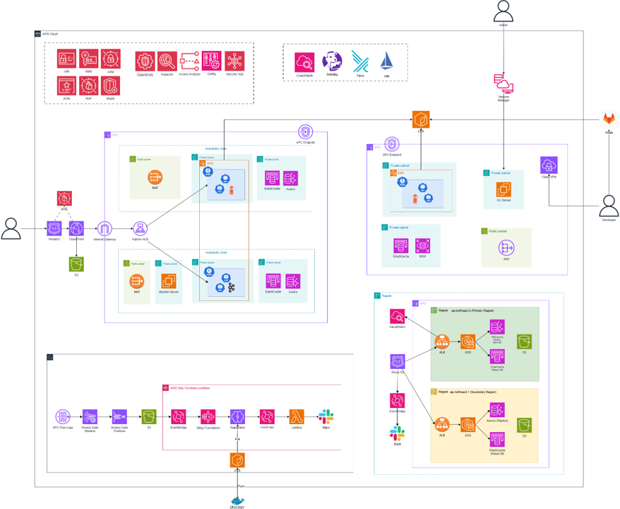
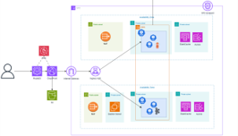
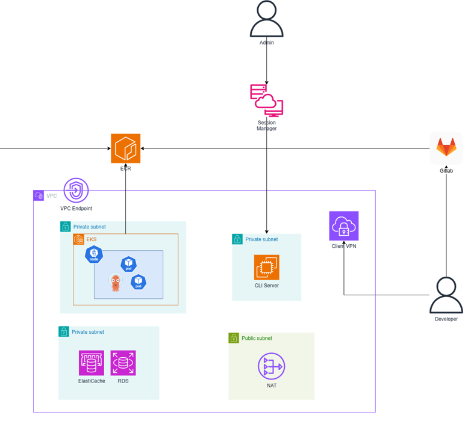

# OliveYoung 대규모 세일 이벤트 시스템

> 🇬🇧 **English version**: see [README.md](README.md)
> 📌 **이 파일은 CloudWave 7기 파이널 프로젝트 시점 한글 README의 보존본입니다.**

> **CloudWave 7기 파이널 프로젝트**
> AWS EKS 기반 고가용성 세일 이벤트 처리 시스템
> 도메인: `clmakase.click` | 리전: `ap-northeast-2`

---

## 핵심 성과

| 지표 | 결과 |
|------|------|
| 최대 동시 접속자 | **150,000 VU** |
| 피크 RPS | **56,300 hits/s** (Datadog 실측) |
| 안정 RPS | **49,500 hits/s** (피크 구간 평균) |
| 총 처리 요청 수 | **4.65M hits** (20분) |
| Success Rate | **100%** (5xx 에러 0건) |
| P99 Latency | **180ms 이하** |
| OOMKilled | **0건** |
| 서비스 중단 | **0건** |
| 최대 API Pod | **100개** (KEDA 자동 스케일) |
| 최대 노드 | **26개** (Karpenter Spot 자동 프로비저닝) |
| 브로커 장애 시 P95 개선 | **3,137ms → 436ms (87%)** |
| 주문 데이터 유실 | **0건** (Non-blocking Retry + DLT) |

> 측정 증빙: [evidence/load-test-2026-02-26/](evidence/load-test-2026-02-26/) — Datadog 실측 스크린샷 + 부하테스트 보고서

---

## 시스템 아키텍처

### 전체 아키텍처


엣지 보안(Route53 · WAF · CloudFront · S3) → Multi-AZ EKS 운영 VPC → 분리된 개발자 접근 VPC(Session Manager · Client VPN · CLI Server) → 관측 플레인(CloudWatch · Datadog · Falco · Istio · Prometheus · Loki · Tempo · Grafana) → 자동화 보안 플레인(IAM · KMS · ASM · GuardDuty · Inspector · Access Analyzer · Config · Security Hub · ACM · WAF · Shield) → 리전 간 DR(`ap-northeast-2` primary ↔ `ap-northeast-1` secondary, Aurora Replica + ElastiCache Global DB) + VPC Flow Logs 포렌식 파이프라인.

### 운영계 아키텍처 (사용자 트래픽)


User → Route53 → CloudFront(S3 정적 프런트엔드 오프로드) → WAF → Internet Gateway → Ingress ALB → EKS Pod (2 AZ Multi-AZ). 두 AZ 를 가로지르는 주황색 박스가 Kafka 3-Broker StatefulSet 의 경계.

### 개발계 아키텍처 (내부 접근)


Admin → Session Manager → ECR. Developer → Client VPN → CLI Server → EKS / RDS / ElastiCache. GitLab → VPC Endpoint → ECR.

### 시연 영상

| 제목 | 링크 |
|---|---|
| 🎬 **부하 테스트 시연** — k6 distributed load test, 150,000 VU 인입 시점 | [youtube.com/watch?v=WcVVNoNMsG8](https://www.youtube.com/watch?v=WcVVNoNMsG8) |
| 🎬 **프론트엔드 시연** — 사용자 입장의 타임세일 흐름 | [youtube.com/watch?v=sHEY-YEHfT4](https://www.youtube.com/watch?v=sHEY-YEHfT4) |

<details>
<summary>📐 텍스트 아키텍처 (CLI 환경용)</summary>

```
사용자
  │ HTTPS
  ▼
CloudFront ──────────────── S3 (React 정적 호스팅)
  │
  ▼
WAF ─── ALB (api.clmakase.click)
              │
              ▼
        EKS Cluster (ap-northeast-2)
          │
          ├─ oliveyoung-api Pod × 1~100
          │    ├─ KEDA ScaledObject
          │    │    ├─ Kafka consumer lag 트리거
          │    │    ├─ Datadog RPS 트리거
          │    │    └─ Cron 트리거 (세일 오픈 Warm-up)
          │    └─ Istio sidecar (mTLS)
          │
          ├─ Kafka 3-Broker StatefulSet
          │    └─ Zookeeper (리더 선출·offset 관리)
          │
          ├─ Karpenter NodePool
          │    └─ c/m/r 패밀리 6세대+, 전량 Spot
          │
          └─ ArgoCD (GitOps selfHeal + prune)
               │
               ├─ Aurora MySQL (Multi-AZ, HikariCP pool 5)
               └─ ElastiCache Redis (대기열 상태 캐싱)
```

</details>

---

## 기술 스택

| 영역 | 기술 |
|------|------|
| **오케스트레이션** | EKS v1.30 + Karpenter v1.0.1 |
| **메시징** | Kafka 3-Broker + Zookeeper |
| **오토스케일링** | KEDA (Kafka lag / Datadog RPS / Cron 복합 트리거) |
| **GitOps** | ArgoCD + GitLab CI/CD (8단계 파이프라인) |
| **서비스 메시** | Istio mTLS + Kiali |
| **데이터** | Aurora MySQL (Multi-AZ) + ElastiCache Redis |
| **IaC** | Terraform 16개 모듈 |
| **모니터링** | Datadog APM + Prometheus (Kiali 전용) |
| **보안** | WAF + KMS + Secrets Manager + Trivy |
| **CDN** | CloudFront + S3 + ACM + Route53 |
| **백엔드** | Spring Boot + Micrometer (커스텀 메트릭 7종) |

---

## CI/CD 파이프라인 8단계

```
git push main
  ↓
[1] test            → Gradle JUnit (allow_failure)
[2] build           → Docker → ECR (commit SHA 태그)
[3] trivy-scan      → CVE 취약점 스캔
[4] update-manifest → deployment.yaml SHA 교체 → git push [skip ci]
[5] deploy-secrets  → KEDA Datadog Secret 주입 (git 외부 관리)
[6] deploy-frontend → npm build → S3 → CloudFront 캐시 무효화
[7] load-test       → k6 (when: manual, allow_failure: true)
  ↓
ArgoCD 감지 → EKS 롤링 배포
```

**설계 포인트**: commit SHA 태그 + `[skip ci]` 무한 루프 방지 + Secret git 외부 관리.

---

## 핵심 트러블슈팅 (10건)

| # | 문제 | 원인 | 해결 |
|---|------|------|------|
| 1 | Kafka 브로커 장애 시 P95 3,137ms | 단일 브로커 SPOF + CB Redis fallback 고지연 | 3-Broker + Non-blocking Retry 전환 |
| 2 | KEDA 스케일링 미동작 | `Deployment.spec.replicas` 고정값이 HPA 명령 덮어씀 | replicas 필드 완전 제거 |
| 3 | 세일 오픈 직후 Cold Start 지연 | `minReplicas: 2`로 사전 준비 부족 | Cron 트리거 + `minReplicas: 10` Warm-up |
| 4 | EKS 노드 프로비저닝 3회 실패 | Managed Node Group 구조적 충돌 | Karpenter 전환 + 16개 연쇄 에러 해결 |
| 5 | Aurora Too many connections | `maxReplicas × pool_size` > `max_connections` | 공식 도출 후 pool 10→5 축소 |
| 6 | ArgoCD selfHeal이 Secret 덮어씀 | Secret을 git YAML에 정의 | Secret 블록 제거, CI 전용 주입 |
| 7 | ArgoCD 배포 미동작 | `latest` 태그 → YAML 변경 없음 → 감지 실패 | commit SHA 태그 + update-manifest job |
| 8 | Mixed Content 차단 | CloudFront 구버전 JS 캐싱 + HTTP URL 하드코딩 | 상대경로 변환 + CI 자동 캐시 무효화 |
| 9 | Terraform 순환 참조 | RDS ↔ Secrets 상호 의존 | Secrets에서 db_host 제거 |
| 10 | istio-proxy OOMKilled | 150k VU 트래픽에서 limit 256Mi 초과 | limit 10Gi + request/limit 분리 |

---

## DB 연결 수 계산 공식

```
총 DB 연결 수 = maxReplicas × HikariCP pool_size ≤ Aurora max_connections
```

스케일 계획 수립 전 반드시 이 공식으로 연결 버짓을 사전 계산. 현재: `pool_size=5`.

---

## Lessons Learned

1. KEDA 사용 시 `Deployment.spec.replicas` 필드는 반드시 제거
2. Secret은 git에 절대 정의하지 않는다 — ArgoCD selfHeal 충돌
3. 이미지 태그는 SHA — `latest`는 ArgoCD가 변경을 감지하지 못함
4. DB 연결 수 = `maxReplicas × pool_size` 사전 계산 필수
5. Probe `initialDelay` = 앱 실제 기동시간 + 10초 이상 여유
6. 스케일링은 반응형 — 세일 오픈 전 Warm-up 전략 필수
7. 빌드 성공 ≠ 배포 완료 — CI와 CD 사이의 Manifest Update 연결 고리 확인

---

## 작성자

**박건우 (gm-15)** — 상명대학교 소프트웨어학과
- GitHub: [github.com/gm-15](https://github.com/gm-15)
- Blog: [velog.io/@gm-15](https://velog.io/@gm-15)
