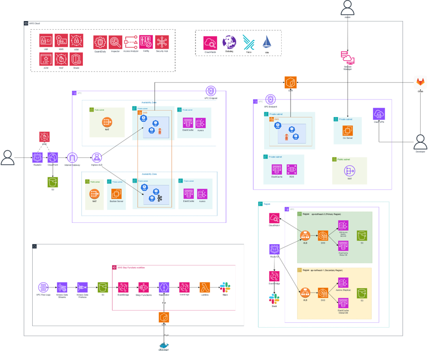
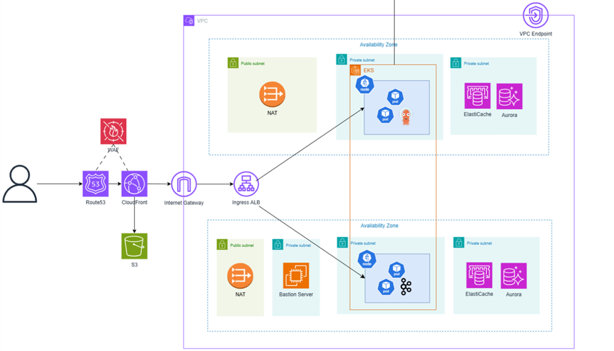
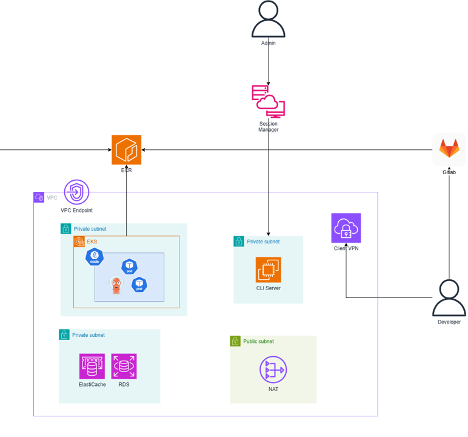

# Clmakase | OliveYoung 플래시 세일 방어 시스템

> **CloudWave 7기 캡스톤**
> AWS EKS 위에 구축한 150,000 VU 동시 접속 방어 시스템. 20분 Datadog 실측으로 검증.
> 도메인: `clmakase.click` · 리전: `ap-northeast-2`

🇬🇧 English version: [README.en.md](README.en.md)

박건우 시그니처: 문제를 기능 구현으로 끝내지 않고, 운영·정합성·확장성 관점에서 다시 설계하는 백엔드 엔지니어. 측정은 항상 한 단계 아래에서.

---

## ✨ 한눈에 보기

- **AWS EKS 기반 운영급 모던 스택**: Kafka 3-Broker StatefulSet, Karpenter (Spot+OnDemand 허용, 150K VU 피크 시 26개 모두 Spot 선택), KEDA 복합 스케일링, ArgoCD GitOps, Istio 서비스 메시 (mTLS PERMISSIVE), Terraform 16 모듈 IaC, GitLab CI/CD 8단계 파이프라인 (GitLab 7-stage + ArgoCD 자동 동기화).
- **150,000 VU 부하 테스트 통과**: OOMKilled 0건, 5xx 0건, P99 ≤ 180 ms, 20분 동안 4.65M 요청 처리, 모두 Spot 인스턴스.
- **백엔드 주도 트러블슈팅 10건**이 본 README에 코드 기준으로 재현 가능하게 정리되어 있습니다. 핵심은 **Aurora "Too many connections" 부등식 도출** (`maxReplicas × pool_size ≤ max_connections`). 스케일아웃 자체가 DB를 공격하는 구조였음을 발견한 사례입니다.

---

## 🛒 왜 이 프로젝트인가 (배경)

이 프로젝트는 **올리브영 플래시 세일**을 모델로 했습니다. 150,000명 이상의 고객이 동일한 한정 수량 상품을 같은 1분 안에 구매를 시도하는 시점, DB 커넥션 고갈, 브로커 장애, 콜드 스타트, 스케일아웃 역설 등 모든 아키텍처 실패 모드가 동시에 표면화되는 워크로드입니다. 올리브영 이벤트를 선택한 이유는:

- **공개·반복·시간 한정** 워크로드라 k6로 재현 가능합니다.
- **정합성 리스크가 큽니다.** 동일 SKU 초과 판매는 신뢰 손실, 과소 판매는 매출 손실, 둘 다 부분 장애 상황에서도 막아야 합니다.
- 전 스택을 한 번에 검증합니다. CDN, 엣지, ALB, EKS, Kafka, Aurora, Redis가 동일 부하 프로파일로 동시에 검증됩니다.

목표: 150,000 VU 스파이크를 5xx 0건, OOM 0건으로 막고, 브로커 장애 복구를 500 ms 안에 완료하는 것. 2026-02-26 Datadog 20분 실측으로 검증.

---

## 🎯 실측 지표 (Datadog, 2026-02-26)

20분 윈도우 동안 Datadog `as_rate()` 쿼리로 측정. 전체 evidence는 [evidence/load-test-2026-02-26/](evidence/load-test-2026-02-26/) 참조.

| 지표 | 값 | 출처 |
|---|---|---|
| **Peak RPS** | **56,300 hits/s** | [Datadog 스크린샷](evidence/load-test-2026-02-26/datadog-rps-overview.png) |
| **Stable RPS** | **49,500 hits/s** (피크 구간 평균) | 동일 |
| **총 처리 요청** | **4.65M hits** (20분) | 동일 (Datadog SUM) |
| **Success Rate** | **100%** (5xx 0건) | 동일 |
| **P99 Latency** | **≤ 180 ms** | Datadog APM |
| **OOMKilled** | **0** | k8s event log |
| **서비스 중단** | **없음** | Datadog uptime |
| **API Pod 최대** | **100** (KEDA `maxReplicas`) | k8s metrics |
| **노드 최대** | **26** Spot 인스턴스 (~128 vCPU / ~600 GB) | Karpenter event log |
| **브로커 장애 P95** | **3,137 ms → 436 ms (87% 개선)** | Version A vs C 비교 ([CSV](.)) |
| **브로커 장애 시 주문 데이터 손실** | **0** (Non-blocking Retry + DLT) | Version C 불변식 |

> **Datadog query**: `sum:trace.servlet.request.hits{service:oliveyoung-api}.as_rate().rollup(max, 1)`
> **측정 윈도우**: 2026-02-26 11:54 ~ 12:14 KST

---

## 👤 역할과 담당

팀 리드로 백엔드 + 인프라 트랙을 직접 소유했습니다. 보안 정책 세부 (WAF 규칙, KMS 키 정책, Cloud Custodian forensics)는 팀원 트랙이며, 저는 Terraform 모듈 합성으로 통합만 했습니다.

### Owned (면접에서 깊이 방어 가능)

- **백엔드 (Spring Boot)**: 주문 처리 서비스, Kafka producer/consumer, `@RetryableTopic` + `@DltHandler`, **Micrometer 커스텀 카운터 7종** (stage별 retry observability).
- **Aurora 커넥션 풀 부등식**: `maxReplicas × pool_size ≤ Aurora_max_connections` 도출, HikariCP `pool_size` 10 → 5로 축소.
- **Kafka 3-Broker StatefulSet**: RF=3, `min.insync.replicas=2`, 20 partitions, Idempotent Producer, 3단계 백오프 (1s → 5s → 30s) + DLT 비차단 retry 토픽.
- **Terraform 16 모듈 IaC 아키텍처**: VPC, EKS, RDS, ElastiCache, ALB controller, ArgoCD, ECR, S3, CloudFront, ACM, Route53, security-groups, secrets, waf, kms, cli (SSM Bastion).
- **Karpenter 마이그레이션**: Managed Node Group → Karpenter 완전 전환, 안정화 과정의 16개 연쇄 에러 해결.
- **KEDA 복합 스케일링**: Kafka consumer-lag 트리거 + Datadog RPS 트리거 + Cron warm-up 트리거. `maxReplicas=100`, `scaleUp 50 pods / 30s` 튜닝.
- **GitLab CI/CD 8단계 파이프라인**: `test → build → trivy-scan → update-manifest → deploy-secrets → deploy-frontend → load-test → ArgoCD trigger`. commit SHA 기반 이미지 태그 재작성 (sed), `[skip ci]` 무한 루프 방지, CloudFront 캐시 자동 무효화 포함.
- **CI DevSecOps**: Trivy CVE 스캔 통합, ECR 자동 스캔 설정, Renovate 의존성 자동 업데이트.
- **K8s 매니페스트**: `Deployment` (`spec.replicas` 필드 의도적 제거 → KEDA single-source-of-truth 보장), KEDA `ScaledObject`, Karpenter `NodePool` + `EC2NodeClass`, Istio 사이드카 리소스 튜닝 (256Mi → 10Gi).
- **150,000 VU 최종 부하 테스트**: 시나리오 설계, k6 분산 실행 (`parallelism=10`, 파드당 15,000 VU, 8 core / 16GB), Expected vs Measured RPS 분석 reflection 작성.

### Team-led (Terraform 모듈 합성만, 정책 내용 작성자 주장하지 않음)

- WAF 규칙 정의
- KMS 키 정책
- Secrets Manager 회전 정책
- Cloud Custodian forensics 정책 (`custodian/iam-forensics.yml`, `custodian/ec2-forensics.yml`)
- Istio mTLS PeerAuthentication 정책 세부

### 🚧 추가 예정 섹션

- **Teamwork & Collaboration**: 리더십 스타일, 갈등 조정, 백엔드/인프라/보안 트랙 소유권 분배. (작성 진행 중)

---

## 🏛️ 시스템 아키텍처

### 전체 아키텍처



AWS 계정 전체를 가로지르는 구성: 엣지 보안 (Route53 → WAF → CloudFront → S3) → Multi-AZ EKS 프로덕션 VPC → 분리된 개발자 접근 VPC (Session Manager + Client VPN + CLI Server) → observability plane (CloudWatch, Datadog, Falco, Istio, Prometheus, Loki, Tempo, Grafana) → 자동화 보안 plane (IAM, KMS, ASM, GuardDuty, Inspector, Access Analyzer, Config, Security Hub, ACM, WAF, Shield) → 리전 DR plane (`ap-northeast-2` primary ↔ `ap-northeast-1` secondary, Aurora Replica + ElastiCache Global DB) → VPC Flow Logs forensics pipeline (VPC Flow Logs → Kinesis Data Streams → Kinesis Data Firehose → S3 → EventBridge → Step Functions → SageMaker → Lambda → Slack).

### Production Plane (사용자 트래픽)



User → Route53 → CloudFront (S3 정적 프론트엔드 오프로드) → WAF → Internet Gateway → Ingress ALB → EKS pods (2개 AZ를 가로지르는 Multi-AZ 구성, 각 public subnet의 NAT로 egress, private data subnet의 ElastiCache + Aurora, 관리 접근용 Bastion Server). 두 AZ를 가로지르는 주황색 박스는 Kafka 3-Broker StatefulSet 경계입니다.

### Development Plane (내부 접근)



Admin → Session Manager → ECR. Developer → Client VPN → CLI Server (private subnet) → EKS / RDS / ElastiCache. GitLab은 VPC Endpoint를 통해 ECR로 이미지를 push. egress는 public-subnet NAT 경유.

### 데모 영상

| 제목 | 링크 |
|---|---|
| 🎬 **Load Test Demo**: k6 분산 부하 테스트로 시스템을 150,000 VU까지 구동 | [youtube.com/watch?v=WcVVNoNMsG8](https://www.youtube.com/watch?v=WcVVNoNMsG8) |
| 🎬 **Frontend Demo**: 사용자 측 플래시 세일 흐름 워크스루 | [youtube.com/watch?v=sHEY-YEHfT4](https://www.youtube.com/watch?v=sHEY-YEHfT4) |

<details>
<summary>📐 텍스트 전용 아키텍처 (터미널 환경용)</summary>

```
User
 │ HTTPS
 ▼
CloudFront ──────────── S3 (React 정적 호스팅)
 │
 ▼
WAF ─── ALB (api.clmakase.click)
            │
            ▼
        EKS Cluster (ap-northeast-2)
          │
          ├─ oliveyoung-api Pod × 1~100
          │   ├─ KEDA ScaledObject
          │   │   ├─ Kafka consumer-lag trigger
          │   │   ├─ Datadog RPS trigger
          │   │   └─ Cron warm-up trigger (세일 오픈)
          │   └─ Istio sidecar (mTLS PERMISSIVE)
          │
          ├─ Kafka 3-Broker StatefulSet
          │   └─ Zookeeper (리더 선출, offset)
          │
          ├─ Karpenter NodePool
          │   └─ c/m/r 6세대+, Spot+OnDemand 혼합
          │
          └─ ArgoCD (GitOps, selfHeal, prune)
              │
              ├─ Aurora MySQL (Multi-AZ, HikariCP pool=5)
              └─ ElastiCache Redis (대기열 상태)
```

</details>

---

## 🔧 기술 스택

| 영역 | 기술 |
|---|---|
| **Orchestration** | EKS v1.30 + Karpenter v1.0.1 |
| **Messaging** | Kafka 3-Broker StatefulSet + Zookeeper (RF=3, `min.insync=2`, 20 partitions) |
| **Auto-scaling** | KEDA 복합 트리거 (Kafka lag / Datadog RPS / Cron warm-up) |
| **GitOps** | ArgoCD + GitLab CI/CD (8단계 파이프라인) |
| **Service mesh** | Istio mTLS (PERMISSIVE 단계, 사이드카 미주입 서비스 Kafka/Zookeeper 검증 후 STRICT 전환 예정) + Kiali |
| **Data** | Aurora MySQL (Multi-AZ) + ElastiCache Redis |
| **IaC** | Terraform 16 모듈 |
| **Monitoring** | Datadog APM + Prometheus (Kiali 전용, 6시간 보존) |
| **Security (CI)** | Trivy CVE 스캔 + ECR auto-scan + Renovate (Owned) |
| **Security (Network/Data)** | WAF + KMS + Secrets Manager + Cloud Custodian (Team-led) |
| **CDN** | CloudFront + S3 + ACM + Route53 |
| **Backend** | Spring Boot · Java 17 · Micrometer (커스텀 카운터 7종) |

---

## 🚦 백엔드 Deep Dives

### 1. 스케일아웃의 역설: Aurora "Too many connections"

부하 테스트 도중 Pod를 늘리는 행위, 즉 부하를 흡수하려고 만든 메커니즘이 오히려 Aurora를 죽였습니다. 결함은 애플리케이션 계층의 커넥션 풀에 있었습니다.

**진단**: Spring Boot Pod 하나가 최대 `pool_size`개의 커넥션을 엽니다. KEDA가 Pod를 `maxReplicas=100`까지 늘리고 기본값 `pool_size=10`이 적용되면, 클러스터는 최대 1,000개의 DB 커넥션을 동시에 요청합니다. Aurora `max_connections` 한도를 훨씬 초과합니다.

**부등식 도출**:
```
total_db_connections = maxReplicas × HikariCP.pool_size
조건:  total_db_connections ≤ Aurora.max_connections
```

**해결 (단일 commit이 아닌 다단)**:

1. HikariCP `pool_size` 10 → 5로 축소.
2. 정직 재검증: Aurora `t3.medium` 기본 `max_connections ≈ 90`. 즉 `100 × 5 = 500`은 여전히 한도를 초과합니다. 풀 축소만으로 부등식 만족 불가.
3. KEDA `minReplicas` 튜닝 + Cron warm-up 트리거 추가, 피크 윈도우에서 *실제* Pod 수가 최악값 100보다 훨씬 낮게 유지되도록 설계.
4. "Aurora 인스턴스 클래스 업그레이드"를 다음 사이클 운영 백로그로 등재, 인프라 계층에서 부등식을 다시 만족시키는 항목으로 분리.
5. 모든 스케일 정책 변경 전 부등식을 사전 검증하는 체크리스트화.

이 사례가 **"인프라를 운영하는 백엔드 엔지니어이지 그 반대가 아닌"** 헤드라인입니다. 증상은 EKS 메트릭, 근본 원인은 Spring Boot 커넥션 풀, 정직한 해결은 두 계층 모두에 필요했습니다.

### 2. Kafka Non-blocking Retry + DLT

초기 아키텍처 (Version A)는 브로커 1대 장애에서 **P95 3,137 ms**와 주문 데이터 유실을 만들었습니다. 원인은 단일 브로커 SPOF + Circuit Breaker → Redis fallback 경로의 자체 고지연이 복합된 것이었습니다.

**재설계 (Version C)**: 3-Broker StatefulSet (RF=3, `min.insync.replicas=2`) + `@RetryableTopic` 기반 non-blocking retry pipeline:

```
order-events (원본)
  │ 실패
  ├─ order-events-retry-0  (1초 지연)   ← 네트워크 지터
  │   │ 실패
  ├─ order-events-retry-1  (5초 지연)   ← DB back-pressure
  │   │ 실패
  ├─ order-events-retry-2  (30초 지연)  ← 심각한 인프라 장애
  │   │ 실패
  └─ order-events.DLT                    ← 수동 replay
```

**결과 (브로커 1대 다운 chaos test, 100 users)**:

| 지표 | Version A | **Version C** |
|---|---|---|
| Throughput | 0.4 req/s | **3.3 req/s** |
| P95 Latency | 3,137 ms | **436 ms (-87%)** |
| 주문 데이터 | **유실** | **무손실** |

Micrometer 커스텀 카운터 7종 (`order_success_total`, `order_retry_total{stage=0|1|2}`, `order_dlt_total`, `kafka_retry_total`, `dlt_messages_total`)이 장애 계층을 대시보드만 보고도 즉시 식별 가능하게 합니다. stage-2 spike는 인프라 장애, stage-0 spike는 일시적 네트워크 지터, 이런 식으로 구분됩니다.

### 3. Cold Start 방어: KEDA Warm-up + Karpenter

세일 오픈 트래픽은 EKS가 새 노드를 프로비저닝하는 속도보다 2분 빨랐고, 처음 30초 동안 cold-start dip이 발생했습니다.

**해결**:
- **Cron 트리거 warm-up**: KEDA `cron` 트리거가 세일 전날 23:50 KST부터 `minReplicaCount`를 10으로 올립니다.
- **공격적 scaleUp**: `50 pods / 30s` 정책 (기본 10/30s 대비).
- **Karpenter consolidation**: 단일 NodePool이 Spot과 OnDemand 모두 허용 (피크 노드 26개는 모두 Spot 선택됨), `consolidationPolicy: WhenUnderutilized`로 비피크 시간 비용 회수.

최종 부하 테스트에서 부하 도달 후 60초 이내에 scale-out 완료됨을 Datadog evidence로 검증.

### 4. CI DevSecOps

직접 소유한 CI 측 보안 자동화 3건:

- **Trivy**: GitLab 파이프라인의 CVE 스캔 단계, high/critical 발견 시 빌드 실패 (실제 Tomcat CVE 1건이 이 게이트에서 패치됨).
- **ECR auto-scan**: 모든 이미지 push 시 AWS ECR 취약점 스캔 트리거, 결과는 AWS 콘솔에서 확인.
- **Renovate**: 의존성 업데이트 PR 자동화, 그룹 패치 + 비긴급 업데이트는 주간 일정.

경계: WAF/KMS/Cloud Custodian *정책 내용*의 작성자는 주장하지 않습니다. 팀원 owned. 저는 Terraform 모듈 참조로 통합만.

---

## 🛠️ 트러블슈팅 10건 (검증됨)

| # | 문제 | 근본 원인 | 해결 | 계층 |
|---|---|---|---|---|
| 1 | Kafka 브로커 장애 → P95 3,137ms | 단일 브로커 SPOF + CB → Redis fallback 지연 | 3-Broker + Non-blocking Retry + DLT | Messaging |
| 2 | KEDA 스케일링 안 됨 | `Deployment.spec.replicas`가 HPA를 덮어씀 | `replicas` 필드 완전 제거 | K8s |
| 3 | 세일 오픈 cold start | `minReplicas=2` 부족 | Cron 트리거 + `minReplicas=10` warm-up | KEDA |
| 4 | EKS 노드 프로비저닝 3회 실패 | Managed Node Group 구조적 충돌 | Karpenter 마이그레이션, 16개 연쇄 에러 해결 | Infra |
| 5 | Aurora "Too many connections" | `maxReplicas × pool_size > max_connections` | 부등식 도출, pool 10 → 5 | **Backend ↔ DB** |
| 6 | ArgoCD selfHeal이 Secret 덮어씀 | Secret을 git YAML에 정의 | Secret YAML 제거, CI 단독 주입 | GitOps |
| 7 | ArgoCD가 새 이미지 배포 안 함 | `latest` 태그 → 매니페스트 무변경 → diff 없음 | commit SHA 태그 + `update-manifest` job | CI/CD |
| 8 | Mixed Content 차단 | CloudFront가 옛 JS 캐싱 + 하드코딩된 `http://` | 상대 경로 + CI 캐시 무효화 | Frontend ops |
| 9 | Terraform 순환 의존 | RDS ↔ Secrets cycle | Secrets 모듈에서 `db_host` 제거 | IaC |
| 10 | istio-proxy 150K VU에서 OOMKilled | memory limit 256Mi 부족 | limit 10Gi로 상향, request/limit 분리 | Service mesh |

각 항목은 저장소 commit history에 대응됩니다.

---

## 📊 엔지니어링 리플렉션: Expected vs Measured RPS

**이론 기대값 (150K VU)**: ~112K RPS.
**실측 피크값**: 56.3K RPS.

이 갭은 오류가 아니라 두 효과의 복합입니다:

1. **Iteration 주기 연장**: 고부하에서 서버 응답 시간이 늘면서 k6 VU iteration 주기가 ~10초에서 20초+로 연장됨. steady state에서 VU당 효과적 RPS 기여가 반으로 줄어듭니다.
2. **사이드카 오버헤드**: 모든 요청이 Istio 사이드카를 통과하고, 프록시의 hop당 비용이 aggregate throughput을 제한합니다.

**결론**: 56.3K RPS는 **error budget 소비 0**, **전량 Spot 인스턴스**에서, **KEDA + Karpenter로 부하 도달 60초 이내 대응** 상태에서 달성. 면접에서 방어할 정확한 수치는 이론값 112K가 아니라 실측 56.3K입니다.

---

## 📁 프로젝트 구조

```
Clmakase/
├── backend/
│   └── src/main/java/com/oliveyoung/sale/
│       ├── config/                          # Redis, Kafka, init data
│       ├── controller/                      # REST controllers
│       ├── domain/                          # Entities (Product, PurchaseOrder)
│       ├── dto/
│       ├── repository/
│       └── service/
│           ├── KafkaProducerService.java
│           ├── KafkaClusterConsumerService.java
│           └── OrderConsumerService.java    # 주문 처리 + Non-blocking Retry
├── frontend/                                # React 앱
├── k8s/
│   ├── deployment.yaml                      # replicas 필드 없음, KEDA 단독 제어
│   ├── keda/
│   │   ├── scaled-object.yaml               # 복합 트리거
│   │   └── trigger-auth-datadog.yaml
│   ├── node-class.yaml                      # Karpenter EC2NodeClass
│   ├── node-pool.yaml                       # Karpenter NodePool (Spot+OnDemand)
│   ├── istio/
│   └── monitoring/
├── terraform/
│   ├── main.tf
│   ├── karpenter_iam.tf
│   └── modules/                             # 16 modules
├── custodian/                               # (team-led)
├── k6/
│   └── load-test.js
├── evidence/
│   └── load-test-2026-02-26/                # Datadog 스크린샷 + 리포트
├── docker-compose-version-a.yml             # 단일 브로커 baseline
├── docker-compose-version-c.yml             # 3-broker + Retry
└── .gitlab-ci.yml                           # 8-stage 파이프라인
```

---

## 🌐 API 명세 (발췌)

### 상품
- `GET /api/products`
- `GET /api/products/{id}`

### 세일 라이프사이클
- `GET  /api/sale/status`
- `POST /api/sale/start`
- `POST /api/sale/end`

### 대기열
- `POST /api/queue/enter`
- `GET  /api/queue/status`

### 구매
- `POST /api/purchase`

공통 응답 형태:
```json
{
  "success": true,
  "data": { },
  "message": "...",
  "errorCode": null
}
```

---

## 🚀 로컬 실행

### Version A (단일 브로커 + Circuit Breaker)
```bash
docker-compose -f docker-compose-version-a.yml up -d
# 프론트엔드: http://localhost:3000
# 백엔드:    http://localhost:8081
```

### Version C (3-broker + Non-blocking Retry)
```bash
docker-compose -f docker-compose-version-a.yml down
docker-compose -f docker-compose-version-c.yml up -d
# 백엔드: http://localhost:8082
```

### A/B 비교 부하 테스트 (로컬)
```powershell
# Windows PowerShell
.\load-test-compare.ps1
```

---

## ❓ 엔지니어링 결정 Q&A

### Q. 왜 SQS 대신 Kafka?
1. **파티션 키 순서 보장**: `productId` 기반 파티셔닝으로 상품별 순서 유지 + 상품 간 병렬 처리.
2. **완전한 retry 제어**: SQS DLQ는 one-shot, `@RetryableTopic`은 실패 원인별로 코드 레벨에서 retry를 계층화.
3. **Replay**: DLT가 실패 메시지를 보존, 분석 후 재처리 가능. 매출 데이터에는 양보 불가 요구사항.

*Trade-off 수용*: 운영 면적 증가 (StatefulSet 관리, 브로커 ID, RF 튜닝).

### Q. 왜 Managed Node Group 대신 Karpenter?
Managed Node Group이 `NodeCreationFailure`로 3회 연속 실패. 팀의 기존 Karpenter 셋업과의 구조적 충돌을 확인한 후 전면 마이그레이션. 자동 인스턴스 패밀리 선택과 Spot 혼합 경제성은 보너스, 동기는 아니었음.

### Q. 왜 대기열에 Redis Sorted Set?
- `score = timestamp` → FIFO 순서
- `ZRANK` → O(log N) 순위 조회
- `ZADD` / `ZREM` → 동시성에서 atomic 연산
- EKS 다중 Pod 사이의 중앙 상태

### Q. Readiness/Liveness probe 어떻게 설정?
```yaml
readinessProbe:
  initialDelaySeconds: 90    # Spring boot ~80초 + 버퍼
  failureThreshold: 5
livenessProbe:
  initialDelaySeconds: 150
  failureThreshold: 5
```
`initialDelaySeconds`는 실제 앱 부팅 시간 + ~10초 이상이어야 합니다. 공격적 probe는 정상 기동 중인 Pod를 종료시킵니다.

---

## 📚 Lessons Learned

1. KEDA를 쓸 때는 **항상 `Deployment.spec.replicas`를 제거**합니다.
2. **Secret을 git YAML에 정의하지 말 것**. ArgoCD selfHeal과 싸우게 됩니다.
3. **이미지 태그는 commit SHA로**. `latest`는 ArgoCD가 변경을 감지하지 못합니다.
4. 모든 스케일 변경 전 **`maxReplicas × pool_size` vs Aurora `max_connections`를 사전 계산**합니다.
5. Probe `initialDelaySeconds`는 실제 부팅 시간 + 10초 최소.
6. Scale-out은 **반응형**, 세일 오픈은 **proactive warm-up**이 필요합니다.
7. **빌드 성공 ≠ 배포 성공**. 매니페스트 업데이트 단계가 CI와 CD 사이 루프를 닫는지 검증.

---

## 🚧 Technical Debt (Designed; implementation in progress)

운영 가능 상태로 닫혔으나 다음 사이클에서 정리할 항목을 정직하게 남깁니다.

- **Datadog APM 완성**: KEDA 트리거는 동작, Micrometer 7종 메트릭 실수집은 `/actuator/prometheus` openmetrics 연동 마무리 필요.
- **k6 summary 보존**: 최종 150K VU 테스트에서 `kubectl apply` 직접 실행으로 summary 유실. 다음 사이클부터 GitLab CI Artifact 보존.
- **Karpenter Spot Interruption Handler**: SQS `interruptionQueue` 제거 상태, SQS 기반 graceful-drain 흐름 재도입 필요.
- **IaC 드리프트**: Fargate Profile, Karpenter IAM inline policy가 수동 생성. `terraform import` 또는 신규 모듈화 예정.
- **Istio mTLS PERMISSIVE → STRICT**: 사이드카 미주입 서비스 (Kafka, Zookeeper) 검증 후 전환 예정.
- **Aurora `instance_class` 업그레이드**: 커넥션 budget 부등식을 인프라 계층에서 다시 만족시키기 위한 다음 사이클 해결.
- **ArgoCD 환경 분리**: 현재 단일 `dev`. `stg` / `prod` 분리는 후속 과제.
- **통합 테스트**: 현재 단위 테스트만 (5 파일 / 24 `@Test`). Kafka/Redis 통합 + 동시성 테스트 필요.
- **CI test 게이트**: `test` 스테이지 현재 `allow_failure: true`. 통합 테스트 추가 후 `false`로 전환.

---

## 📋 Roadmap

- 아키텍처 다이어그램 PNG/Mermaid 정식화 (ASCII 버전 대체)
- 대기열 인증 계층 (HMAC 서명 토큰, 평문 자체 발급 대체)
- 멀티 리전 active-active 배포 계획
- Kafka Zookeeper → KRaft 마이그레이션
- velog.io/@gm-15에 부하 테스트 요약 글 공개

---

## 👤 Author

**박건우 (gm-15)** · 상명대학교 소프트웨어학과
Backend & Infrastructure Engineering · Clmakase 팀 리드
- GitHub: [github.com/gm-15](https://github.com/gm-15)
- Blog: [velog.io/@gm-15](https://velog.io/@gm-15)
- Email: gunwoo363@gmail.com
